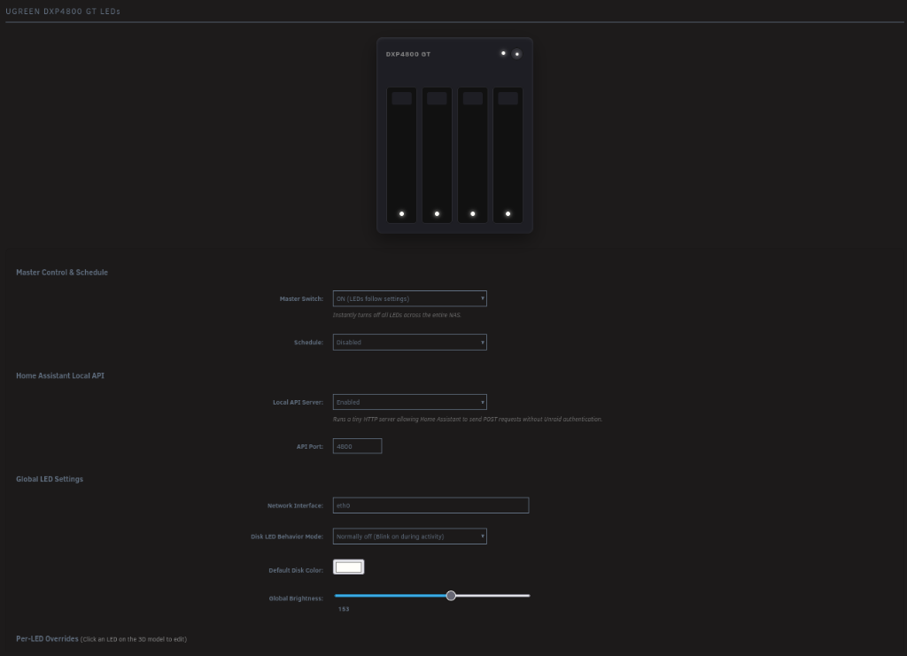

# UGREEN DXP4800 GT LEDs - Unraid Plugin

A plugin for Unraid to control the LEDs on the UGREEN DXP4800 GT NAS. This plugin provides a Web UI, an RGB color picker, per-bay control, scheduling, and a local API server for integrations like Home Assistant.



## Installation

### 1. Compile and Install the LED Driver

Before using this plugin, you must compile and load the `led-ugreen` kernel module specifically built with a fix for the DXP4800 GT write issues.

A script is provided to automate the compilation using Docker:
```bash
# Download and execute the compilation script on your Unraid server
curl -sL https://raw.githubusercontent.com/TheMysticle/dxp4800-gt-leds/master/compile_driver.sh | bash
```
*(This process takes 5-10 minutes and downloads the driver from PR 100 on the `miskcoo/ugreen_leds_controller` repository).*

After the compilation finishes successfully, clean up any old module, and load the newly compiled module with the new write protocol:
```bash
# Clean up ghost I2C device
for d in /sys/bus/i2c/devices/i2c-*/delete_device; do echo "0x3a" > "$d" 2>/dev/null; done

# Remove the broken module if it exists
rmmod led-ugreen 2>/dev/null

# Load the fixed module WITH the new write protocol parameter enabled
insmod /boot/config/ugreen_leds/led-ugreen.ko write_protocol=smbus-block
```

### 2. Install the Unraid Plugin

Navigate to the **Plugins** tab in your Unraid Web UI, select **Install Plugin**, and enter the following URL:

```
https://raw.githubusercontent.com/TheMysticle/dxp4800-gt-leds/master/dxp4800-gt-leds.plg
```

Click **Install**. You can now access the settings by going to **Settings > dxp4800-gt-leds**.

---

## Manual LED Control (Reference)

If you wish to control the LEDs manually via the command line instead of using the plugin UI, here are some helpful commands:

### Turn off all LEDs

```bash
# Terminate the plugin monitoring daemon
kill $(pgrep -f ugreen-leds) 2>/dev/null
kill $(pgrep -f dxp4800-gt-led-monitor) 2>/dev/null

# Turn off the LEDs manually
for led in /sys/class/leds/*; do
  echo none > "$led/trigger" 2>/dev/null
  echo 0 > "$led/brightness" 2>/dev/null
done
```

### Link LAN activity to Network LED (Flicker)

```bash
# 1. Tell the kernel this LED should react to network activity
echo netdev > /sys/class/leds/netdev/trigger

# 2. Tell it to watch the eth0 interface
echo eth0 > /sys/class/leds/netdev/device_name

# 3. Tell it to turn on when there is a link, and blink on RX/TX
echo 1 > /sys/class/leds/netdev/link
echo 1 > /sys/class/leds/netdev/rx
echo 1 > /sys/class/leds/netdev/tx

# 4. Set the blink interval to 50ms (so it flickers instead of staying solid)
echo 50 > /sys/class/leds/netdev/interval
```

### Turn on HDD Lights to Max Brightness

```bash
# Turn on disk1 and disk2 to maximum brightness
echo 255 > /sys/class/leds/disk1/brightness
echo 255 > /sys/class/leds/disk2/brightness
```

### List Available LED Names

```bash
ls -1 /sys/class/leds/
# Outputs: disk1, disk2, disk3, disk4, disk5, disk6, disk7, disk8, netdev, power
```
